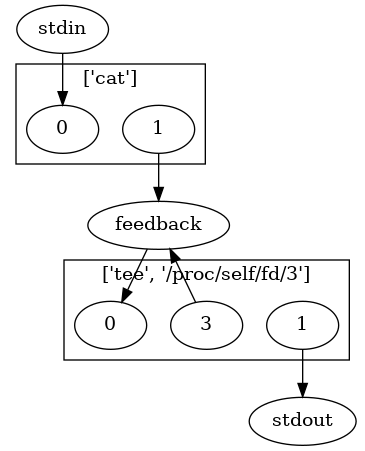
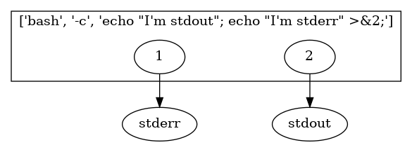
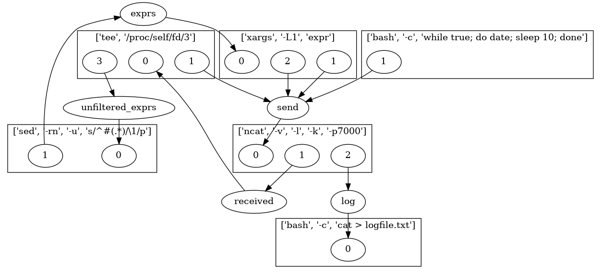

PGSpawn
=======

Dead simple utility for spawning graph of processes connected by pipes in UNIX system. Each process is being equiped with specified UNIX pipes at specified file descriptors. Whole graph description is contained in a YAML file.

`pgspawn` is awesome! Why? Here are some arguments for it:

* It follows the UNIX philosophy.
* It's simple and understandable.
* It uses standard syntax - YAML is well known and pretty.
* It uses standard pipe semantics - UNIX pipe is battle-tested.
* It's language agnostic. `pgspawn` doesn't care about language - it spawns just *processes*.
* It's efficient. After spawning phase all work is done by OS.

Examples
--------

Check the `examples/` directory.

As input `pgspawn` takes YAML file with graph description in it.

### id

A very simple, single-node graph can be as follows:

    $ cat examples/id.yml
    nodes:
      - command: [cat]
    $ echo abc | pgspawn examples/id.yml
    abc

It spawns `cat` program and doesn't do anything about file descriptors,
so child process inherits standard fds (probably stdin, stdout, stderr).

### yes

We can do more complex. Lets write `yes` program counterpart:

    $ cat examples/yes.yml
    nodes:
      - command: [cat]
        outputs:
          1: feedback
      - command: [tee, /proc/self/fd/3]
        inputs:
          0: feedback
        outputs:
          3: feedback
    $ echo y | pgspawn examples/yes.yml
    y
    y
    y
    ...

What it does is create pipe (named internally `feedback`) and use it to
feed output into input. Section `outputs: {1: feedback}` describes that
file descriptor 1 used by `cat` (it's stdout) is fed into our pipe.
Section `inputs: {0: feedback}` denotes that fd 0 of `tee` program is
read from `feedback` pipe.

Graph drawn with explicitly connected stdin and stdout:

### swap stdout-stderr

It's possible to use parent's program fds in `inputs` and `outputs` descriptions.
Just give them names and roll:

    $ cat examples/swap.yml
    outputs:
      stdout: 1
      stderr: 2
    nodes:
      - command: [bash, -c, echo "I'm stdout"; echo "I'm stderr" >&2;]
        outputs:
          1: stderr
          2: stdout
    $ pgspawn examples/swap.yml > /dev/null
    I'm stdout
    $ pgspawn examples/swap.yml 2> /dev/null
    I'm stderr

Similar you can do with `inputs` (see `examples/id_explicite.yml`).

### server

More complicated example is shown in `examples/server.yml`.
It's a TCP chat with expression evaluation.

pg2dot
------

For documentation purposes there is `pg2dot` program that converts YAML
description of graph into [DOT file](https://en.wikipedia.org/wiki/DOT_(graph_description_language)
supported by [graphviz](http://www.graphviz.org/).

To generate image run something like:

    cat examples/yes_explicite_full.yml | pg2dot | dot -T png -o graph.png

Similar tools
-------------

* [pipexec](https://github.com/flonatel/pipexec)
